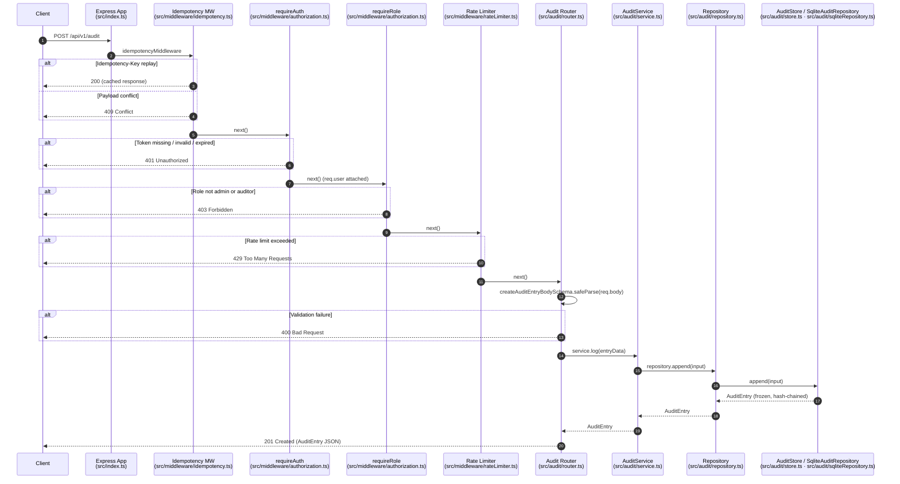

# Audit Request Lifecycle — POST /api/v1/audit

This document traces the end-to-end lifecycle of a single audit-log write
request (`POST /api/v1/audit`) from the moment it arrives at the Express
router through validation, authentication, the service handler, and final
persistence in the audit store.

Target audience: new contributors who have not previously worked in this
codebase. Each section names the exact file and function involved so you can
jump straight to the source.

> The audit router is only mounted when the `AUDIT_ENABLED` environment
> variable is truthy (see `src/index.ts` line 54). When the flag is off,
> every `/api/v1/audit/*` request falls through to the global 404 handler.

---

## Request Flow Overview



---

## Stage 1 — Validation

**File**: `src/audit/router.ts`  
**Schema**: `createAuditEntryBodySchema` imported from `src/audit/schemas.ts`

The POST `/` route handler is the first place the request body is inspected.
Validation runs inline using `createAuditEntryBodySchema.safeParse(req.body)`.

### What the schema enforces

| Field | Rule |
|---|---|
| `action` | Required; must be one of the 20 allowed `AuditAction` enum values |
| `severity` | Required; `INFO`, `WARNING`, or `CRITICAL` |
| `actor` | Required; non-empty string |
| `resource` | Required; non-empty string |
| `resourceId` | Required; non-empty string |
| `metadata` | Optional; defaults to `{}` when omitted |
| `ipAddress` | Optional string |
| `correlationId` | Optional string |

The schema is defined in `src/audit/schemas.ts` as:

```typescript
// src/audit/schemas.ts
export const createAuditEntryBodySchema = z.object({
  action: auditActionSchema,          // z.enum(AUDIT_ACTIONS)
  severity: auditSeveritySchema,      // z.enum(AUDIT_SEVERITIES)
  actor: z.string().min(1, 'actor must not be empty'),
  resource: z.string().min(1, 'resource must not be empty'),
  resourceId: z.string().min(1, 'resourceId must not be empty'),
  metadata: z.record(z.unknown()).optional().default({}),
  ipAddress: z.string().min(1).optional(),
  correlationId: z.string().min(1).optional(),
});
```

### On validation failure

If `safeParse` returns `success: false`, the handler calls
`buildValidationErrorResponse` (defined in `src/audit/router.ts`) and
immediately responds `400` with a structured JSON error before the request
reaches the service layer.

```jsonc
// 400 response shape
{
  "error": {
    "code": "validation_error",
    "message": "Request validation failed",
    "requestId": "<req-id>",
    "correlationId": "<x-correlation-id>",  // when present
    "details": [{ "path": ["actor"], "message": "actor must not be empty" }]
  }
}
```

### On validation success — correlation ID injection

After a successful parse the handler reads the correlation ID from
`res.locals` (placed there upstream by `requestContext` middleware) via
`getCorrelationId(res)`. If the caller did not supply a `correlationId` in
the request body, the ambient correlation ID is injected into `entryData`
before the service is called. This ensures every audit entry can be tied
back to the originating request chain without the caller having to know the
correlation ID in advance.

> **Note — `inputValidation.ts`**: The file `src/audit/inputValidation.ts`
> contains a more comprehensive validation module (`CreateAuditEntrySchema`,
> `validateCreateAuditEntry` middleware) that enforces additional bounds:
> maximum string lengths, metadata depth limits, control-character
> rejection, and prototype-pollution key detection. It is **not currently
> wired into this route**. The route uses `createAuditEntryBodySchema` from
> `schemas.ts` instead. A future contributor reading `inputValidation.ts`
> can treat it as a hardening layer that is available but not yet activated
> on the write path.

---

## Stage 2 — Authentication & Authorization

Authentication and authorization are applied as Express middleware and are
mounted as `accessMiddleware` when the router is created in `src/index.ts`:

```typescript
// src/index.ts
createAuditRouter({
  accessMiddleware: [requireAuth, requireRole('admin', 'auditor'), auditQueryLimiter],
  // ...
})
```

The three middleware run in order before the route handler is reached.

### 2a. Idempotency (`idempotencyMiddleware`)

**File**: `src/middleware/idempotency.ts`  
**Function**: `createIdempotencyMiddleware()` — exported singleton is `idempotencyMiddleware`

This middleware runs **before** `accessMiddleware` (see the `router.post('/', idempotencyMiddleware, ...accessMiddleware, handler)` call in `src/audit/router.ts`).

When an `Idempotency-Key` header is present:

1. The request body is SHA-256 hashed (canonically serialised) to produce a payload fingerprint.
2. If the key is already in the store with a **matching** hash → the cached response is replayed immediately as `200`.
3. If the key is in the store with a **different** hash → `409 Conflict` (`idempotency_payload_conflict`).
4. If the key is currently in-flight → `409 Conflict` (duplicate concurrent request).
5. Otherwise the key and hash are registered as in-flight, the response is intercepted via `res.send` monkey-patching, and the result is cached after the handler responds.

Requests without the header pass straight through.

### 2b. JWT Authentication (`requireAuth`)

**File**: `src/middleware/authorization.ts`  
**Function**: `requireAuth`

Validates the `Authorization: Bearer <token>` header using `jsonwebtoken`:

- Algorithm is pinned to HS256 via `JWT_VERIFY_OPTIONS` from `src/auth/jwtConfig.ts` — `alg: none` and algorithm-confusion attacks are rejected before signature verification.
- `jwt.verify()` enforces `exp` — expired tokens are rejected automatically.
- Required claims: `sub` (user ID), `email`, `role`.
- `role` is re-validated against the platform allowlist (`src/lib/authorization.ts`) after decode; a token carrying an arbitrary role string is always rejected.
- On success, a typed `User` object `{ id, email, role }` is attached to `req.user` for downstream middleware.

| Failure condition | Response |
|---|---|
| Missing / malformed `Authorization` header | `401` |
| Bad signature or tampered payload | `401` |
| Token expired | `401` |
| Missing `sub` or `email` claim | `401` |
| Unrecognised `role` value | `401` |

### 2c. Role-Based Authorization (`requireRole`)

**File**: `src/middleware/authorization.ts`  
**Function**: `requireRole('admin', 'auditor')`

Checks `req.user.role` (set by `requireAuth`) against the allowed list. Only
`admin` and `auditor` roles can reach the audit write handler. Any other
authenticated role receives `403 Forbidden`.

| Condition | Response |
|---|---|
| `req.user` absent (requireAuth skipped) | `401` |
| Role not in `['admin', 'auditor']` | `403` |

### 2d. Rate Limiting (`auditQueryLimiter`)

**File**: `src/middleware/rateLimiter.ts` (factory); config in `src/config/rateLimit.ts`  
**Function**: `createRateLimiter({ ...rateLimitConfig.audit, keyFn: auditActorKeyFn('audit') })`

The rate limit key is `audit:<userId>:<clientIP>` (built by `auditActorKeyFn`
in `src/index.ts`), so each actor-plus-IP pair gets its own independent bucket.

**`audit` tier defaults** (overridable via environment variables):

| Parameter | Default | Env var |
|---|---|---|
| Max requests per window | **300** | `RL_AUDIT_MAX` |
| Window duration | **60 s** | `RL_AUDIT_WINDOW_MS` |
| Abuse threshold (violations before hard block) | **5** | `RL_AUDIT_ABUSE_THRESHOLD` |
| Block observation window | 5 min | `RL_AUDIT_BLOCK_WINDOW_MS` |
| Initial hard-block duration | 10 min | `RL_AUDIT_BLOCK_DURATION_MS` |
| Maximum hard-block duration | 24 h | `RL_AUDIT_MAX_BLOCK_MS` |

Response headers (`X-RateLimit-Limit`, `X-RateLimit-Remaining`,
`X-RateLimit-Reset`) are sent on every request (`sendHeaders: true`). On
limit breach the response is `429 Too Many Requests`.

---

## Stage 3 — Handler

**File**: `src/audit/router.ts`  
**Function**: Anonymous route handler inside `createAuditRouter()`, registered as `router.post('/', ...)`

After all middleware pass, the handler:

1. **Validates the body** with `createAuditEntryBodySchema.safeParse(req.body)` (Stage 1 above).
2. **Injects the correlation ID** into `entryData.correlationId` when the caller omitted it (see Stage 1).
3. **Delegates to the service**: calls `service.log(entryData)` — `service` is the `AuditService` singleton from `src/audit/service.ts`, or an injected override when the router is constructed in tests.
4. **Responds `201 Created`** with the returned `AuditEntry` JSON.

### Error handling

Errors thrown by the service layer are caught by a `try/catch` block in the
handler. The HTTP status code is chosen by inspecting the error message:

```typescript
// src/audit/router.ts
const status = message.startsWith('Missing required fields:') ? 400 : 500;
```

> **Code note**: this status-code decision is coupled to the string content of
> `Error.message`. If the service ever changes that message prefix, the
> handler would silently return `500` for what should be a `400`. This is a
> known fragility documented here for future reference; the fix would be to
> use a typed `AppError` class with an explicit `statusCode` field (see
> `src/errors/appError.ts`).

---

## Stage 4 — Persistence

### 4a. Service layer (`AuditService.log`)

**File**: `src/audit/service.ts`  
**Class/Method**: `AuditService.log(input: CreateAuditEntryInput): AuditEntry`

`log` is a thin facade over the repository:

1. Calls `this.repository.append(input)`.
2. On success, invalidates the read cache for `input.resourceId` (cache layer detail is out of scope for this doc; one sentence: the `AuditCache` instance is invalidated by `resourceId` so stale query results do not survive a write to the same resource).
3. On error, logs via `console.error` then **re-throws** — the calling handler is expected to catch it.

The singleton exported as `auditService` is constructed with
`createDefaultAuditRepository()` and no cache options (cache is opt-in at
construction time).

### 4b. Repository selection (`createDefaultAuditRepository`)

**File**: `src/audit/repository.ts`  
**Function**: `createDefaultAuditRepository(): AuditLogRepository`

Selects the storage backend from the `AUDIT_STORAGE_BACKEND` environment
variable:

| Value | Backend |
|---|---|
| `memory` (default) | `AuditStore` — `src/audit/store.ts` |
| `sqlite` | `SqliteAuditRepository` — `src/audit/sqliteRepository.ts` |
| anything else | throws `Error: Unsupported AUDIT_STORAGE_BACKEND` at startup |

### 4c. In-memory backend (`AuditStore.append`)

**File**: `src/audit/store.ts`  
**Class/Method**: `AuditStore.append(input: CreateAuditEntryInput): AuditEntry`

Used by default (and exclusively in tests). Sequence for each append:

1. Checks and sets a re-entrancy guard (`_appendGuard`) — throws if a concurrent call sneaks in.
2. Reads the `hash` of the last entry in the log, or uses `GENESIS_HASH` (`"GENESIS"`) for the first entry ever.
3. Builds a partial entry (all fields except `hash`) with a fresh `randomUUID()` and `new Date().toISOString()` timestamp.
4. Computes `computeEntryHash(partial)`: SHA-256 over a canonical JSON serialisation of all fields including `previousHash`. This chains each entry cryptographically to its predecessor — any tampering breaks the chain.
5. Freezes the complete entry with `Object.freeze` (immutability enforced at runtime).
6. Pushes the entry onto the private `log` array.

Errors: re-entrancy throws immediately; array push is effectively atomic for
Node's single-threaded event loop, so no partial-write rollback is needed.

### 4d. SQLite backend (`SqliteAuditRepository.append`)

**File**: `src/audit/sqliteRepository.ts`  
**Class/Method**: `SqliteAuditRepository.append(input: CreateAuditEntryInput): AuditEntry`

Used when `AUDIT_STORAGE_BACKEND=sqlite`. Sequence:

1. Wraps the entire operation in a `better-sqlite3` transaction (via `this.db.transaction()`).
2. Queries `SELECT hash FROM audit_log_entries ORDER BY seq DESC LIMIT 1` to get the previous hash (uses `GENESIS_HASH` when the table is empty).
3. Builds the partial entry, computes the SHA-256 hash chain using `computeEntryHash` (same function as the in-memory store — defined in `src/audit/store.ts` and imported here).
4. Inserts the complete row: `INSERT INTO audit_log_entries (id, timestamp, action, severity, actor, resource, resource_id, metadata_json, ip_address, correlation_id, hash, previous_hash)`.
5. `metadata` is serialised to JSON string for column `metadata_json` and deserialised back on read by `toAuditEntry`.
6. Returns the frozen `AuditEntry`.

The transaction auto-rolls back on any error, so a failed insert cannot leave a partial or orphaned row in the hash chain.

---

## Error Response Summary

| Stage | Condition | HTTP Status |
|---|---|---|
| Idempotency | Key reused with different payload | `409` |
| Idempotency | Key already in-flight | `409` |
| Authentication | Missing/invalid/expired token | `401` |
| Authorization | Role not `admin` or `auditor` | `403` |
| Rate limiting | Bucket exhausted | `429` |
| Validation | Schema parse failure | `400` |
| Handler (caught) | Service throws "Missing required fields:" | `400` |
| Handler (caught) | Any other service error | `500` |
| Persistence | Re-entrancy in AuditStore | `500` (uncaught, propagates) |
| Persistence | SQLite transaction failure | `500` (uncaught, propagates) |

---

## Key Files Quick Reference

| File | Role |
|---|---|
| `src/index.ts` | Mounts the audit router with `accessMiddleware`; defines rate-limit key function |
| `src/audit/router.ts` | Route definitions; inline body validation; response shaping |
| `src/audit/schemas.ts` | Zod schemas for request bodies and query params |
| `src/middleware/idempotency.ts` | Idempotency-Key deduplication |
| `src/middleware/authorization.ts` | `requireAuth` (JWT) and `requireRole` (RBAC) |
| `src/middleware/rateLimiter.ts` | Rate limiter factory |
| `src/config/rateLimit.ts` | All rate-limit tier defaults and env-var overrides |
| `src/audit/service.ts` | `AuditService` — application facade over the repository |
| `src/audit/repository.ts` | Backend selector (`createDefaultAuditRepository`) |
| `src/audit/store.ts` | In-memory append-only hash-chained store; `computeEntryHash` |
| `src/audit/sqliteRepository.ts` | SQLite-backed store with identical hash-chain logic |
| `src/utils/correlationId.ts` | `getCorrelationId` / `getRequestId` helpers used in the router |
