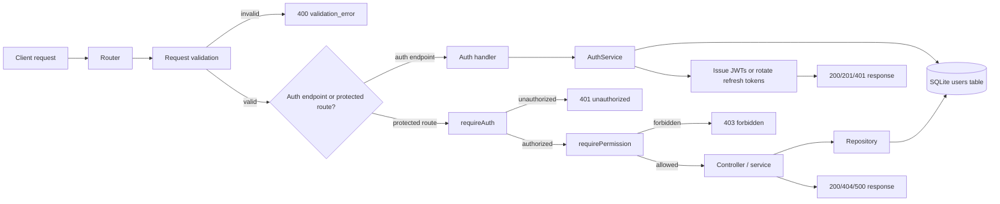

# Auth request lifecycle

This guide traces the current backend auth flow from the moment an HTTP request arrives until the response is returned. The implementation is split across the Express router layer, validation middleware, auth middleware, service logic, and the SQLite persistence layer.

## High-level path

## 1. Request enters the router

The first stop is the route layer.

- Auth endpoints live in [src/routes/auth.routes.ts](src/routes/auth.routes.ts).
- Protected resources such as contracts are mounted in [src/routes/contracts.routes.ts](src/routes/contracts.routes.ts).

For example:

- `POST /auth/login` validates credentials and calls the auth service.
- `POST /auth/logout` validates the caller with auth middleware before revoking the refresh token.
- `GET /api/v1/contracts` passes through auth and permission middleware before the controller executes.

## 2. Validation runs before the handler

Before business logic runs, the request is validated with Zod through [src/middleware/validate.middleware.ts](src/middleware/validate.middleware.ts).

The middleware:

- parses the request body, query, and params together,
- replaces the request object with the validated values,
- returns `400` with a structured `validation_error` response if the payload is invalid.

The auth routes define explicit schemas for login, register, and refresh in [src/routes/auth.routes.ts](src/routes/auth.routes.ts). Those schemas enforce:

- email format and size,
- password minimum length,
- required fields for registration,
- strict rejection of unknown keys.

## 3. Authentication middleware attaches the caller identity

For routes that require a signed-in user, the request passes through [src/middleware/authorization.ts](src/middleware/authorization.ts).

The middleware chain is:

1. `requireAuth`
2. optionally `requireRole` or `requirePermission`

`requireAuth`:

- reads the `Authorization: Bearer <token>` header,
- verifies the JWT using the centralized settings from [src/auth/jwtConfig.ts](src/auth/jwtConfig.ts),
- rejects malformed, expired, or tampered tokens with `401`,
- attaches a normalized user object to `req.user` when validation succeeds.

This is the key handoff point between “who is calling?” and “what are they allowed to do?”

## 4. Authorization checks the user’s permissions

After authentication succeeds, a protected route may run `requirePermission` from [src/middleware/authorization.ts](src/middleware/authorization.ts).

That middleware:

- reads the authenticated user from `req.user`,
- checks the permission matrix from [src/lib/authorization.ts](src/lib/authorization.ts),
- returns `403` when the caller lacks access,
- allows the handoff to the controller when the permission is granted.

For routes such as contracts, the owner lookup is resolved from the database before the permission check is finalized.

## 5. The handler delegates to the auth service

The route handler itself is intentionally thin. It delegates the meaningful work to [src/services/auth.service.ts](src/services/auth.service.ts).

That service handles four core operations:

- `register`: creates a user, hashes the password, issues tokens, and stores the refresh token hash.
- `login`: verifies the submitted password against the stored hash, issues tokens, and stores the new refresh token hash.
- `refresh`: verifies the refresh JWT, checks the hash against the database, rotates the token, and issues a new pair.
- `logout`: clears the stored refresh token hash for the current user.

### Security behavior in the service

The auth service:

- uses `scrypt` for password hashing,
- uses `timingSafeEqual` for password comparison,
- stores only a SHA-256 hash of the refresh token,
- signs access tokens with the same algorithm that the middleware verifies.

## 6. Persistence happens in SQLite

The request eventually reaches the persistence layer through [src/db/database.ts](src/db/database.ts).

The database is opened once per process and schema migrations are applied by [src/db/migrations.ts](src/db/migrations.ts). The auth-related columns are added to the `users` table so the service can persist:

- `password_hash`
- `refresh_token_hash`

That means the end-to-end lifecycle is:

1. request arrives,
2. validation runs,
3. auth middleware identifies the caller,
4. the handler delegates to the auth service,
5. the service reads or writes the `users` table,
6. the response is returned to the client.

## 7. Request examples

### Login flow

`POST /auth/login`

- body validation runs first,
- the route calls `AuthService.login`,
- the service checks the stored password hash,
- a new access/refresh token pair is issued,
- the refresh token hash is written to SQLite.

### Protected resource flow

`GET /api/v1/contracts`

- validation checks the query string,
- `requireAuth` verifies the bearer JWT,
- `requirePermission` checks the role and ownership rules,
- the controller/service reads contract data from the repository,
- the repository reads from SQLite and returns the payload.

## Summary

The current auth lifecycle is a straight pipeline:

- router → validation → auth/authorization middleware → handler/service → persistence → response.

That sequence is implemented across the following files:

- [src/routes/auth.routes.ts](src/routes/auth.routes.ts)
- [src/middleware/validate.middleware.ts](src/middleware/validate.middleware.ts)
- [src/middleware/authorization.ts](src/middleware/authorization.ts)
- [src/services/auth.service.ts](src/services/auth.service.ts)
- [src/db/database.ts](src/db/database.ts)
- [src/db/migrations.ts](src/db/migrations.ts)
