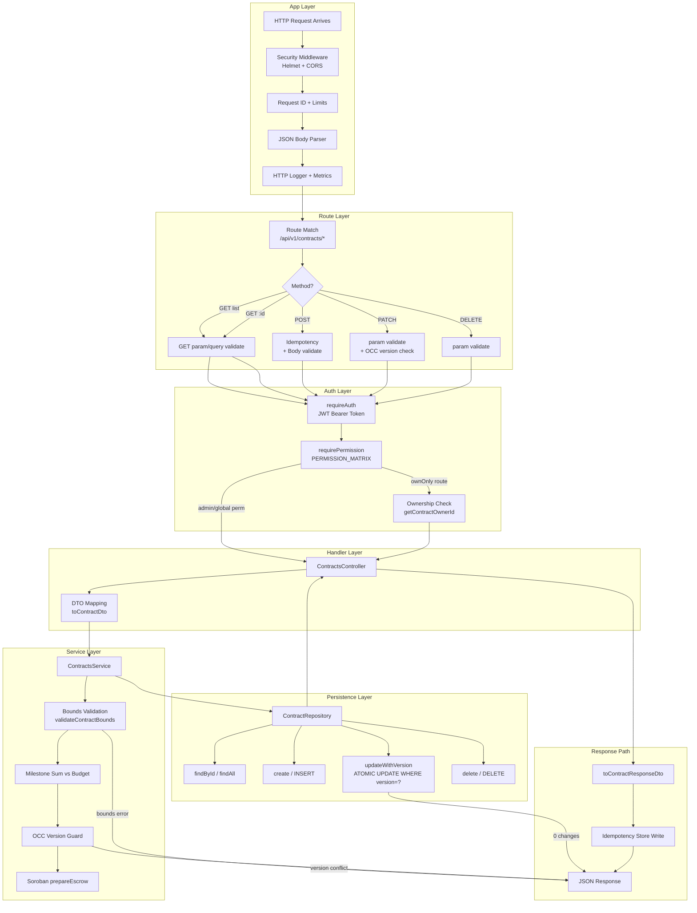

# Contracts Request Lifecycle

End-to-end walkthrough of a contracts API request from HTTP ingress through
validation, authentication, authorization, handler, service, and persistence.

## Overview Diagram



---

## Global App Middleware (Ingress)

Every request to `/api/v1/contracts/*` passes through the following chain
registered in [app.ts](file:///c:/Users/USER/downloads/drips/Talenttrust-Backend/src/app.ts#L63-L127).

| Step | Middleware | Source | Purpose |
|------|-----------|--------|---------|
| 1 | `applySecurityMiddleware` | [middleware/security.ts](file:///c:/Users/USER/downloads/drips/Talenttrust-Backend/src/middleware/security.ts) | Helmet headers + CORS allowlist via `CORS_ALLOWED_ORIGINS` |
| 2 | `requestIdMiddleware` | [middleware/requestId.ts](file:///c:/Users/USER/downloads/drips/Talenttrust-Backend/src/middleware/requestId.ts) | Reads/injects `X-Request-Id`; available on `res.locals.requestId` |
| 3 | `createRequestLimitsMiddleware` | [middleware/requestLimits.ts](file:///c:/Users/USER/downloads/drips/Talenttrust-Backend/src/middleware/requestLimits.ts) | Caps body size, URL length, and header count to block abuse |
| 4 | `express.json()` | Express | Parses JSON body; rejects malformed JSON with 400 |
| 5 | `httpLoggerMiddleware` | [middleware/httpLogger.ts](file:///c:/Users/USER/downloads/drips/Talenttrust-Backend/src/middleware/httpLogger.ts) | Structured request/response logging with PII redaction |
| 6 | `metricsService.trackHttpRequest` | [observability/metrics-service.ts](file:///c:/Users/USER/downloads/drips/Talenttrust-Backend/src/observability/metrics-service.ts) | HTTP duration + status counters per route |

Routes are mounted at [app.ts#L96](file:///c:/Users/USER/downloads/drips/Talenttrust-Backend/src/app.ts#L96):

```ts
app.use('/api/v1/contracts', contractsModuleRouter);
```

The router is exported from [routes/contracts.routes.ts](file:///c:/Users/USER/downloads/drips/Talenttrust-Backend/src/routes/contracts.routes.ts)
via `createContractsRouter()` which wires the DB, repository, service, and
controller together at route-registration time.

---

## Route Table & Handler Chain

All contracts endpoints are defined in
[contracts.routes.ts](file:///c:/Users/USER/downloads/drips/Talenttrust-Backend/src/routes/contracts.routes.ts#L110-L201).
Each route composes a specific middleware order — the ordering is security-
sensitive, so each route is documented individually below.

### GET /api/v1/contracts — List contracts

```
validateContractQuery → requireAuth → requirePermission → controller.getContracts
```

1. **`validateContractQuery`** — inlined function at [contracts.routes.ts#L68-L101](file:///c:/Users/USER/downloads/drips/Talenttrust-Backend/src/routes/contracts.routes.ts#L68-L101).
   Runs **before** auth so malformed `page`/`limit`/`status`/`sortBy`/UUID params
   are rejected with 400 without burning an auth check. After Zod validation
   against `contractQuerySchema` ([contract.dto.ts#L278-L308](file:///c:/Users/USER/downloads/drips/Talenttrust-Backend/src/modules/contracts/dto/contract.dto.ts#L278-L308))
   unknown query keys (`admin`, `debug`, etc.) are **stripped** from `req.query`
   before the controller sees them.

2. **`requireAuth`** — see [Authentication](#authentication) below.

3. **`requirePermission('contracts', 'list')`** — see [Authorization](#authorization) below.

4. **`controller.getContracts`** — [contracts.controller.ts#L29-L61](file:///c:/Users/USER/downloads/drips/Talenttrust-Backend/src/controllers/contracts.controller.ts#L29-L61).
   Parses pagination, calls `service.getAllContracts()`, applies page slice,
   maps to `ContractResponseDto`, returns 200 with metadata.

### GET /api/v1/contracts/:id — Fetch single contract

```
validateContractId → requireAuth → requirePermission(…, getContractOwnerId) → controller.getContractById
```

1. **`validateContractId`** — inlined at [contracts.routes.ts#L30-L50](file:///c:/Users/USER/downloads/drips/Talenttrust-Backend/src/routes/contracts.routes.ts#L30-L50).
   Rejects empty IDs or IDs exceeding `CONTRACT_ID_MAX_LENGTH` (128 chars).
   Runs **before auth** — oversized or obviously-invalid IDs never hit the DB.
   Uses `contractIdParamSchema` from [contract.dto.ts#L258-L265](file:///c:/Users/USER/downloads/drips/Talenttrust-Backend/src/modules/contracts/dto/contract.dto.ts#L258-L265).

2. **`requireAuth`** — see below.

3. **`requirePermission('contracts', 'read', getContractOwnerId)`** — ownership
   check via `getContractOwnerId` at [contracts.routes.ts#L121-L124](file:///c:/Users/USER/downloads/drips/Talenttrust-Backend/src/routes/contracts.routes.ts#L121-L124).
   Resolves the contract's `clientId` from the repository. If the contract
   does not exist, returns **404** (not 403) to avoid leaking existence.
   See [Authorization](#authorization).

4. **`controller.getContractById`** — [contracts.controller.ts#L63-L77](file:///c:/Users/USER/downloads/drips/Talenttrust-Backend/src/controllers/contracts.controller.ts#L63-L77).
   Calls `service.getContractById()`. Returns 404 `NotFoundError` if missing.

### POST /api/v1/contracts — Create contract

```
requireAuth → requirePermission → contractCreateIdempotencyMiddleware → validateSchema(createContractSchema) → controller.createContract
```

1. **`requireAuth`** + **`requirePermission('contracts', 'create')`** — auth
   runs before idempotency so idempotency keys are always user-scoped (see
   [contractIdempotency.ts#L77-L89](file:///c:/Users/USER/downloads/drips/Talenttrust-Backend/src/middleware/contractIdempotency.ts#L77-L89):
   rejects with 401 if no user scope can be resolved as a fail-closed guard).

2. **`contractCreateIdempotencyMiddleware`** — [middleware/contractIdempotency.ts](file:///c:/Users/USER/downloads/drips/Talenttrust-Backend/src/middleware/contractIdempotency.ts).
   - Requires `Idempotency-Key` header (400 if missing).
   - Scopes the key to the authenticated user via SHA-256: `sha256(userId:key)`.
   - Computes a payload hash from a **canonical JSON** serialization (sorted
     keys, stable array order) so semantically identical bodies collide even
     if whitespace/key order differs.
   - Same key + same hash → replays cached response verbatim with
     `Idempotency-Replayed: true` header.
   - Same key + different hash → **409 Conflict**.
   - On first execution, intercepts `res.json()` to stash `{statusCode, body}`
     in `defaultIdempotencyStore` before the response is sent.

3. **`validateSchema(createContractSchema)`** — [middleware/validate.middleware.ts#L35-L63](file:///c:/Users/USER/downloads/drips/Talenttrust-Backend/src/middleware/validate.middleware.ts#L35-L63).
   Wraps the body with `{body: req.body}` and parses through Zod. The schema
   is in [contract.dto.ts#L139-L182](file:///c:/Users/USER/downloads/drips/Talenttrust-Backend/src/modules/contracts/dto/contract.dto.ts#L139-L182):
   - Required: `title`, `description`, `clientId`, `budget`.
   - Optional: `freelancerId`, `deadline`, `status`, `terms`, `milestones`.
   - `.strip()` drops unknown keys from the body (not `.strict()` — the
     write-path strictness is reserved for PATCH [updateContractSchema](file:///c:/Users/USER/downloads/drips/Talenttrust-Backend/src/modules/contracts/dto/contract.dto.ts#L112-L131)).
   - Milestone count is intentionally **not** capped here; that's enforced by
     the service layer's `validateContractBounds` which returns a 422
     `contract_bounds_error` — a distinct error code the schema layer must
     not shadow with a 400.
   - On validation failure: returns 400 with structured `validation_error`
     details (path, message, code) plus the scoped `requestId`.

4. **`controller.createContract`** — [contracts.controller.ts#L79-L96](file:///c:/Users/USER/downloads/drips/Talenttrust-Backend/src/controllers/contracts.controller.ts#L79-L96).
   Maps the DTO via `toCreateContractDto` ([contracts-boundary.dto.ts#L55-L73](file:///c:/Users/USER/downloads/drips/Talenttrust-Backend/src/modules/contracts/dto/contracts-boundary.dto.ts#L55-L73))
   to isolate transport types from service types. Calls `service.createContract()`.
   Catches `ContractBoundsError` and returns a 422 `contract_bounds_error`.
   Returns 201 on success with the mapped response DTO.

### PATCH /api/v1/contracts/:id — Update contract (OCC)

```
validateContractId → requireAuth → requirePermission(…, getContractOwnerId) → validateUpdateContract → controller.updateContract
```

1. **`validateContractId`** — same as GET-by-id; runs before auth to cheaply
   reject bad IDs.

2. **Auth + ownership** — same as GET-by-id.

3. **`validateUpdateContract`** — [validation.middleware.ts](file:///c:/Users/USER/downloads/drips/Talenttrust-Backend/src/modules/contracts/validation.middleware.ts).
   Three-step ordered validation, each short-circuits via `next(error)`:
   1. **Version absent?** → `MissingVersionError` (custom 400 `ERR_MISSING_VERSION`).
   2. **Version not non-negative integer?** → `InvalidVersionError` (custom 400 `ERR_INVALID_VERSION`).
   3. **Full body schema** against `updateContractSchema` ([contract.dto.ts#L112-L131](file:///c:/Users/USER/downloads/drips/Talenttrust-Backend/src/modules/contracts/dto/contract.dto.ts#L112-L131)).
      Uses `.strict()` on both the body object and each milestone so unknown
      keys (e.g. injected `admin: true` or milestone `payoutOverride`) are
      **rejected** with 400 rather than silently dropped. This is the
      dispute-resolution write path — strictness prevents bypassing status
      flows via extra fields. If version itself re-fails here (shouldn't, but
      defense-in-depth), converts to `InvalidVersionError` so the client
      sees the same semantic error code.

4. **`controller.updateContract`** — [contracts.controller.ts#L98-L116](file:///c:/Users/USER/downloads/drips/Talenttrust-Backend/src/controllers/contracts.controller.ts#L98-L116).
   Maps body via `toUpdateContractDto` ([contracts-boundary.dto.ts#L79-L100](file:///c:/Users/USER/downloads/drips/Talenttrust-Backend/src/modules/contracts/dto/contracts-boundary.dto.ts#L79-L100)),
   calls `service.updateContract()`, catches `ContractBoundsError` as 422.

### DELETE /api/v1/contracts/:id — Delete contract

```
validateContractId → requireAuth → requirePermission(…, getContractOwnerId) → controller.deleteContract
```

1. **`validateContractId`** — same pattern.

2. **Auth + ownership** — same pattern.

3. **`controller.deleteContract`** — [contracts.controller.ts#L118-L129](file:///c:/Users/USER/downloads/drips/Talenttrust-Backend/src/controllers/contracts.controller.ts#L118-L129).
   Calls `service.deleteContract()`, which throws 404 if nothing was deleted.

---

## Authentication

Implemented in [middleware/authorization.ts](file:///c:/Users/USER/downloads/drips/Talenttrust-Backend/src/middleware/authorization.ts#L94-L140).

### Flow (`requireAuth`)

1. Extract bearer token via `extractBearerToken` from
   [lib/authHelpers.ts](file:///c:/Users/USER/downloads/drips/Talenttrust-Backend/src/lib/authHelpers.ts).
   Missing/malformed `Authorization` → **401**.
2. `jwt.verify(token, JWT_SECRET, JWT_VERIFY_OPTIONS)`:
   - Signature algorithm is **pinned to HS256** via `JWT_VERIFY_OPTIONS` in
     [auth/jwtConfig.ts](file:///c:/Users/USER/downloads/drips/Talenttrust-Backend/src/auth/jwtConfig.ts).
     `alg: none` and RS/HS confusion are rejected before signature check.
   - `exp` claim is enforced natively by the library → **401 Token has expired**.
3. Required claims guard: `sub` + `email` must be present → **401 missing claims**.
4. Role re-validation: `decoded.role` is checked against `ALL_ROLES = {admin, auditor, client, freelancer}`
   via `isValidRole()` ([lib/authorization.ts#L16-L18](file:///c:/Users/USER/downloads/drips/Talenttrust-Backend/src/lib/authorization.ts#L16-L18)).
   Arbitrary role strings in a signed-but-maliciously-issued token are caught
   here → **401 unrecognised role**.
5. Attach `req.user = {id, email, role}` (typing via `AuthenticatedRequest` in
   [lib/types.ts](file:///c:/Users/USER/downloads/drips/Talenttrust-Backend/src/lib/types.ts)).

### JWT Payload shape

```json
{
  "sub":   "<userId>",
  "email": "<userEmail>",
  "role":  "admin" | "auditor" | "client" | "freelancer",
  "iat":   <issuedAt>,
  "exp":   <expiresAt>
}
```

---

## Authorization

Implemented in [middleware/authorization.ts](file:///c:/Users/USER/downloads/drips/Talenttrust-Backend/src/middleware/authorization.ts#L208-L277)
and backed by the exhaustive `PERMISSION_MATRIX` in
[lib/authorization.ts](file:///c:/Users/USER/downloads/drips/Talenttrust-Backend/src/lib/authorization.ts#L64-L145).

### The contracts cell in the matrix

| Resource   | Action | admin | auditor | client | freelancer |
|------------|--------|-------|---------|--------|------------|
| `contracts`| create | ✅    | ❌      | ✅     | ❌         |
| `contracts`| read   | ✅    | ✅      | OWN    | OWN        |
| `contracts`| update | ✅    | ❌      | OWN    | OWN        |
| `contracts`| delete | ✅    | ❌      | ❌     | ❌         |
| `contracts`| list   | ✅    | ✅      | OWN    | OWN        |

Where:
- ✅ = always allowed
- ❌ = always denied
- OWN = allowed only if `resourceOwnerId === user.id` (admin is always exempt)

### Flow (`requirePermission`)

1. **No user on request?** → **401** (defense-in-depth — requireAuth should
   have already attached one).
2. **If `getResourceOwnerId` callback provided** (GET/PATCH/DELETE `:id`):
   - Look up record in DB. Null return → **404 not_found** (avoids leaking
     whether a forbidden record exists).
   - Stores resolved owner ID in-scope for the matrix evaluator.
3. **`isAuthorized({user, resource, action, resourceOwnerId})`** —
   [lib/authorization.ts#L184-L265](file:///c:/Users/USER/downloads/drips/Talenttrust-Backend/src/lib/authorization.ts#L184-L265):
   1. Runtime deny-by-default safety net — if any of `resource`/`action`/
      `role` triplet isn't in the matrix, log a structured `warn` and deny.
   2. Cell value `false` → deny (403).
   3. Cell value `true` → grant.
   4. Cell value `{ownOnly: true}`:
      - Admin → always grant (admin bypass).
      - No `resourceOwnerId` → deny (ownership couldn't be verified).
      - `resourceOwnerId !== user.id` → deny (different owner).
      - Otherwise → grant (confirmed owner).
4. **Failure cases** in the resolver throw → **500 internal_error** rather
   than leaking as a 403.

### Ownership resolution for contracts

The resolver `getContractOwnerId` at
[contracts.routes.ts#L121-L124](file:///c:/Users/USER/downloads/drips/Talenttrust-Backend/src/routes/contracts.routes.ts#L121-L124)
returns `contract.clientId`, so the **client** is treated as the canonical
owner for `ownOnly` checks. Freelancers match the `OWN` cell when their
`user.id` is also present as `contract.freelancerId` — this works because
the permission matrix for freelancers carries `ownOnly: true`, and the
ownership check resolves to `clientId`. For freelancer-owned contracts, the
permission matrix entry evaluates to `OWN` and matches when the freelancer
is the assigned `freelancerId` on the record (the `isAuthorized` check passes
because it falls through to the final case when `resourceOwnerId === user.id`).

---

## Handler / Controller Layer

The controller is `ContractsController` in
[controllers/contracts.controller.ts](file:///c:/Users/USER/downloads/drips/Talenttrust-Backend/src/controllers/contracts.controller.ts).
It's instantiated via `createContractsController(service)` which binds methods
so they can be passed directly as Express handlers without losing `this`.

### Responsibilities

1. **DTO boundary mapping** — uses explicit mappers from
   [contracts-boundary.dto.ts](file:///c:/Users/USER/downloads/drips/Talenttrust-Backend/src/modules/contracts/dto/contracts-boundary.dto.ts)
   so transport-only fields (description, deadline, terms, milestones) never
   leak into the service domain, and the persistence `Contract` shape never
   leaks back onto the wire:
   - `toCreateContractDto` — inbound from `CreateContractRequestDto` to `CreateContractDto`.
   - `toUpdateContractDto` — inbound from `UpdateContractRequestDto` to `UpdateContractDto`.
   - `toContractResponseDto` — outbound from `Contract` to `ContractResponseDto`.
2. **Pagination parsing** — for list endpoints: `parsePaginationQuery` +
   `applyPagination` from [utils/pagination.ts](file:///c:/Users/USER/downloads/drips/Talenttrust-Backend/src/utils/pagination.ts).
3. **HTTP error specialization** — catches `ContractBoundsError` and remaps
   to HTTP 422 with code `contract_bounds_error` (distinct from the 400
   validation_error used by the schema layer).
4. **Standard response envelope** — uses `ok()` / `fail()` from
   [utils/apiResponse.ts](file:///c:/Users/USER/downloads/drips/Talenttrust-Backend/src/utils/apiResponse.ts).
5. **404 for missing records** — throws `NotFoundError` for GET-by-id when
   service returns undefined.

---

## Service Layer

`ContractsService` lives at
[services/contracts.service.ts](file:///c:/Users/USER/downloads/drips/Talenttrust-Backend/src/services/contracts.service.ts).
It's the business-logic boundary between the presentation layer and persistence.

### createContract

At [contracts.service.ts#L61-L100](file:///c:/Users/USER/downloads/drips/Talenttrust-Backend/src/services/contracts.service.ts#L61-L100):

1. **Global bounds check** via `validateContractBounds(budget, milestones)`
   from [contracts/bounds.ts](file:///c:/Users/USER/downloads/drips/Talenttrust-Backend/src/contracts/bounds.ts#L51-L83).
   Enforces hard policy caps:
   - Budget ≤ `MAX_CONTRACT_AMOUNT_STROOPS` (10,000,000 XLM = 100_000_000_000_000 stroops)
   - Milestone count ≤ `MAX_MILESTONES_PER_CONTRACT` (20)
   - Sum of milestone amounts ≤ global stroop cap
   - Violations throw `ContractBoundsError` → 422.
2. **Per-contract milestone vs budget guard** — separately verifies that the
   sum of individual milestone amounts does not exceed the caller-supplied
   `budget`. This is a tighter, caller-specified bound than the global cap
   and prevents payout overrun.
3. **Repository create** — delegates to `contractRepository.create()` with
   mapped fields (`budget` is stored as `amount`, `status` defaults to `draft`).
4. **Soroban prepareEscrow** — best-effort call to
   [services/soroban.service.ts](file:///c:/Users/USER/downloads/drips/Talenttrust-Backend/src/services/soroban.service.ts)
   to prepare the on-chain escrow. Failure is logged as a warning and **does
   not fail the API call** — this is an eventually-consistent notification.

### updateContract (Optimistic Concurrency Control)

At [contracts.service.ts#L130-L167](file:///c:/Users/USER/downloads/drips/Talenttrust-Backend/src/services/contracts.service.ts#L130-L167):

1. **Defense-in-depth version validation** — re-checks that `version` is
   present and is a non-negative integer, throwing `MissingVersionError` /
   `InvalidVersionError`. The middleware already checked this — this is the
   service-layer guard in case middleware is bypassed.
2. **No-op patch rejection** — if all fields are `undefined` (only `version`
   was provided), rejects with a generic error. Clients get a clear signal
   instead of a misleading 200 that changed nothing.
3. **Re-run bounds validation** when `budget` or `milestones` are in the
   patch so updates can't widen a contract past policy limits.
4. **Field mapping** — maps DTO fields to `Contract` fields (e.g.
   `budget` → `amount`, `freelancerId` nullish coalescing).
5. **Repository update** via `updateWithVersion(id, fields, version)` —
   atomicity is delegated to the DB (see [Persistence](#persistence-layer)).
   Returns the updated contract with `version + 1`.

### Other methods

- `getAllContracts` / `getContractById` / `deleteContract` — direct repository passthrough.
- `getContractsPage` — cursor pagination via `findPage` in repository.
- `getContractStats` — aggregates `total`, `totalBudget`, and `byStatus` counts.
- `getBounds` — returns the public policy constants for the `GET /bounds` endpoint.

---

## Persistence Layer

`ContractRepository` at
[repositories/contractRepository.ts](file:///c:/Users/USER/downloads/drips/Talenttrust-Backend/src/repositories/contractRepository.ts)
is the SQLite-backed DAL implementing the `IContractRepository` interface.
An `InMemoryContractRepository` is provided for tests.

### The `Contract` domain shape

Defined in [db/types.ts#L29-L38](file:///c:/Users/USER/downloads/drips/Talenttrust-Backend/src/db/types.ts#L29-L38):

```ts
interface Contract {
  id: string;          // UUID PK
  title: string;
  clientId: string;
  freelancerId: string;
  amount: number;      // in stroops
  status: ContractStatus;  // draft|active|completed|disputed|cancelled
  createdAt: string;   // ISO-8601
  version: number;     // OCC counter, starts at 0
}
```

### create

At [contractRepository.ts#L123-L156](file:///c:/Users/USER/downloads/drips/Talenttrust-Backend/src/repositories/contractRepository.ts#L123-L156):

- Generates UUID via `randomUUID()`.
- ISO timestamp via `new Date().toISOString()`.
- Status defaults to `"draft"` and is re-validated by `assertValidContractStatus`
  against `VALID_CONTRACT_STATUSES` even though SQLite carries a CHECK
  constraint — some CI SQLite builds don't enforce CHECK on every write path,
  so the code-level guard keeps behavior deterministic.
- `version` is initialized to `0`.
- One-shot prepared `INSERT` statement (cached by SQLite driver on first call).

### findById / findAll

Simple prepared SELECTs. `findAll` orders by `created_at DESC`. Row mapping
converts snake_case DB columns (`client_id`, `freelancer_id`, `amount`,
`created_at`) to camelCase via the `toContract()` helper.

### updateWithVersion (Atomic OCC)

At [contractRepository.ts#L158-L192](file:///c:/Users/USER/downloads/drips/Talenttrust-Backend/src/repositories/contractRepository.ts#L158-L192):

**This is the single source of truth for OCC correctness.** The UPDATE is
atomic and self-checking:

```sql
UPDATE contracts
SET    title         = COALESCE(?, title),
       status        = COALESCE(?, status),
       amount        = COALESCE(?, amount),
       freelancer_id = COALESCE(?, freelancer_id),
       version       = version + 1
WHERE  id = ? AND version = ?
```

Key properties:
1. `COALESCE(?, col)` pattern means an omitted (null) field preserves the
   existing value — partial PATCHes work without separate queries.
2. The `version = version + 1` increment happens **inside the same atomic
   statement** as the WHERE check. There is no read-then-write race.
3. `result.changes === 0` is treated as a version conflict. Either the row
   didn't exist, or (more commonly) another writer bumped the version first.
   `VersionConflictError` is thrown, mapped to HTTP 409 by the global error
   handler.
4. After a successful update, re-reads the row via `findById` to return the
   fresh contract (with incremented version) to the caller.

### findPage (Cursor pagination)

At [contractRepository.ts#L201-L238](file:///c:/Users/USER/downloads/drips/Talenttrust-Backend/src/repositories/contractRepository.ts#L201-L238).
Uses the (createdAt, id) tie-breaker pattern from
[contracts/cursor.repository.ts](file:///c:/Users/USER/downloads/drips/Talenttrust-Backend/src/contracts/cursor.repository.ts):

- Selects `limit + 1` rows; the extra row signals "has next page".
- No cursor → ordered `LIMIT ?`.
- With cursor → `WHERE (created_at < ? OR (created_at = ? AND id < ?))` for
   stable keyset pagination (no page-number drift under concurrent writes).
- Returns `{data, nextCursor, hasNextPage, limit}`.

### delete

Simple `DELETE FROM contracts WHERE id = ?`; returns `changes > 0` so the
service can throw 404 if nothing was deleted.

---

## Response Path & Terminal Handlers

### Normal success flow

1. Controller calls `ok(res, payload, meta?, statusOverride?)` from
   [utils/apiResponse.ts](file:///c:/Users/USER/downloads/drips/Talenttrust-Backend/src/utils/apiResponse.ts).
2. For POST: `contractCreateIdempotencyMiddleware`'s wrapped `res.json`
   intercepts, hashes and stores `{statusCode, body}` in the idempotency store,
   then delegates to the real `res.json`.
3. `httpLoggerMiddleware` (outer) logs the response status and duration.
4. Socket-level `clientError` handler installed by [app.ts#L115-L124](file:///c:/Users/USER/downloads/drips/Talenttrust-Backend/src/app.ts#L115-L124)
   hardens the server edge against protocol-level malformed requests.

### Error handling

Registered in [app.ts#L50-L56](file:///c:/Users/USER/downloads/drips/Talenttrust-Backend/src/app.ts#L50-L56):

- **404** — `notFoundHandler` for unmatched routes.
- **Global error handler** — `errorHandler` from
  [middleware/errorHandlers.ts](file:///c:/Users/USER/downloads/drips/Talenttrust-Backend/src/middleware/errorHandlers.ts):
  maps `AppError` subclasses to HTTP codes:
  - `NotFoundError` → 404 `not_found`
  - `MissingVersionError` → 400 `ERR_MISSING_VERSION`
  - `InvalidVersionError` → 400 `ERR_INVALID_VERSION`
  - `VersionConflictError` → 409 `version_conflict`
  - Zod validation errors → 400 `validation_error` (with per-field details)
  - Unknown errors → 500 `internal_error` (stack trace hidden from client,
    logged server-side via `logger.error`).

---

## Quick Reference: Endpoints vs Permissions

| Method | Path | Permission | Roles | ownOnly |
|--------|------|-----------|-------|---------|
| GET | `/bounds` | `contracts:read` | admin, client, freelancer | client & freelancer |
| GET | `/stats` | `contracts:list` | admin, client, freelancer | client & freelancer |
| GET | `/` | `contracts:list` | admin, auditor, client, freelancer | client & freelancer |
| GET | `/:id/history` | — (no auth) | — | — |
| GET | `/:id` | `contracts:read` | admin, auditor, client, freelancer | client & freelancer |
| POST | `/` | `contracts:create` | admin, client | — |
| PATCH | `/:id` | `contracts:update` | admin, client, freelancer | client & freelancer |
| DELETE | `/:id` | `contracts:delete` | admin | — |
