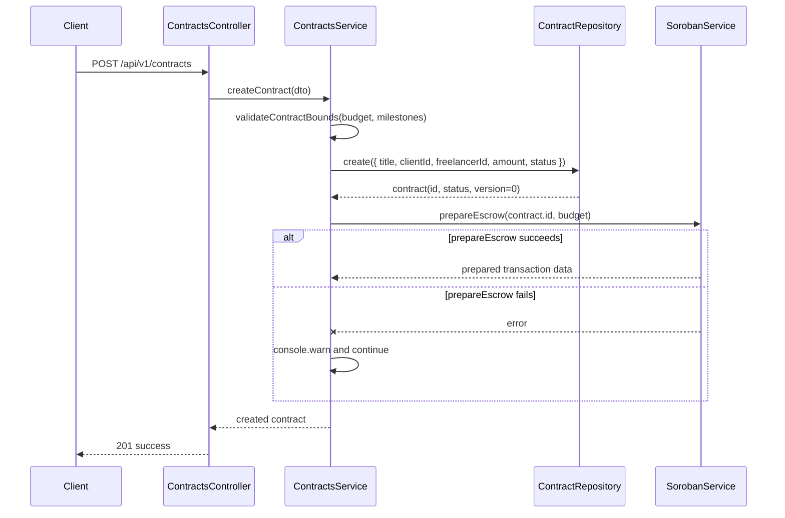

# Contract Lifecycle and Bounds

This document describes the backend lifecycle for escrow contract records, the
policy bounds enforced before persistence, and the non-fatal Soroban
`prepareEscrow` step used during contract creation.

## Status Lifecycle

Contract status is validated at the request layer and again by the SQLite
`contracts.status` CHECK constraint. The persisted status values are:

- `draft`
- `active`
- `completed`
- `disputed`
- `cancelled`

The conceptual escrow path is:

```text
draft -> funded/active -> completed
```

In the current backend, the funded or escrow-ready phase is represented by the
stored `active` status. There is no literal `funded` status in the DTO enum or
database CHECK constraint. Contracts may also move from `draft` or `active` to
`disputed` or `cancelled` when the caller submits an accepted PATCH status
change. The backend validates that a submitted status is one of the accepted
values, but it does not enforce a stricter transition graph between those
values.

`POST /api/v1/contracts` creates a contract with `draft` status by default
unless the request supplies another accepted status. The update endpoint,
`PATCH /api/v1/contracts/:id`, currently persists `title` and `status` changes
through the service layer.

## Optimistic Concurrency

Every contract row carries a non-negative `version` field. New rows start at
`version = 0`.

PATCH updates require clients to send the version value they last read:

```json
{
  "version": 0,
  "status": "active"
}
```

`ContractRepository.updateWithVersion` performs the concurrency check in the
SQL `UPDATE` statement:

```sql
UPDATE contracts
SET title = COALESCE(?, title),
    status = COALESCE(?, status),
    version = version + 1
WHERE id = ? AND version = ?
```

The update succeeds only when the stored version matches the supplied version.
On success, the repository increments `version` by exactly 1 and returns the
updated row. If no row is changed, the repository throws `VersionConflictError`
with HTTP status `409` and error code `ERR_CONFLICT`; callers should fetch the
latest contract and retry with the current version.

## Bounds Policy

Contract bounds are defined in `src/contracts/bounds.ts`:

| Constant | Value | Meaning |
|---|---:|---|
| `MAX_MILESTONES_PER_CONTRACT` | `20` | Maximum milestones accepted for a contract payload |
| `MAX_CONTRACT_AMOUNT_STROOPS` | `100_000_000_000_000` | Maximum budget or total milestone amount in stroops (`10,000,000` XLM) |

`validateContractBounds` rejects:

- `budget` values greater than `MAX_CONTRACT_AMOUNT_STROOPS`
- milestone arrays with more than `MAX_MILESTONES_PER_CONTRACT` entries
- milestone amount totals that are non-finite or greater than
  `MAX_CONTRACT_AMOUNT_STROOPS`

For create requests, the controller returns bounds errors as `422` responses
before any contract is persisted.

## Bounds Discovery Endpoint

Clients can discover the active policy with:

```http
GET /api/v1/contracts/bounds
```

The endpoint returns `CONTRACT_BOUNDS`:

```json
{
  "status": "success",
  "data": {
    "maxMilestonesPerContract": 20,
    "maxContractAmountStroops": 100000000000000
  }
}
```

These values are hard-coded policy decisions and are not fetched from the
Soroban contract at runtime.

## Create to Prepare-Escrow Flow

Contract creation persists the off-chain record first, then attempts to prepare
the Soroban escrow transaction. `prepareEscrow` is best-effort in this flow:
failures are logged with `console.warn` and are not fatal to `createContract`.
The API still returns the newly created contract when the Soroban preparation
step fails after persistence.



Because the Soroban preparation step is non-fatal, consumers that require a
prepared escrow transaction should inspect downstream escrow state separately
instead of treating a successful create response as proof that on-chain
preparation succeeded.
