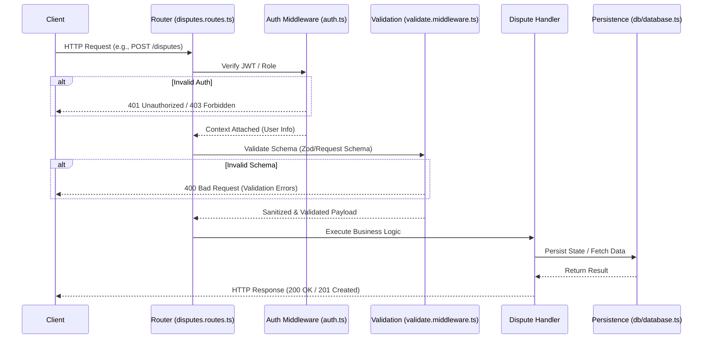

# Disputes Request Flow

This document provides an end-to-end view of the request lifecycle for the Disputes feature. It is designed to help new contributors understand how a request moves from the routing layer through middleware, into the handler, and down to the database.

## Architecture Diagram

## Request Lifecycle Breakdown
### 1. Routing (`src/routes/disputes.routes.ts`)
The request enters the application through the disputes router. This file is responsible for mapping specific HTTP methods and endpoints to their respective middleware chains and controller handlers.
### 2. Authentication & Authorization (`src/middleware/auth.ts` & `src/middleware/authorization.ts`)
Before any business logic is executed, the request must pass through the security layer:
- **Auth Guard**: Validates the incoming JWT or API key to ensure the user is authenticated.
- **Role Check**: Ensures the authenticated identity has the necessary permissions to perform the requested dispute action.
### 3. Validation (`src/middleware/validate.middleware.ts`)
Once authenticated, the request body, query parameters, and parameters are validated against strictly defined schemas (typically utilizing `zod` via `src/validation/requestSchema.ts`). This ensures the handler only ever receives safely formatted and expected data.
### 4. Handler / Controller
The controller acts as the orchestrator for the specific route. It extracts the validated payload and the authenticated user context, then invokes the necessary business logic (often delegating complex logic to dedicated service layers).
### 5. Persistence (`src/db/database.ts` & Repository Layer)
If the dispute request requires saving or fetching state, the handler interfaces with the database layer. This is handled using the configured database client, which executes the necessary SQL operations and returns the entities back up the chain to be formulated into an HTTP response.