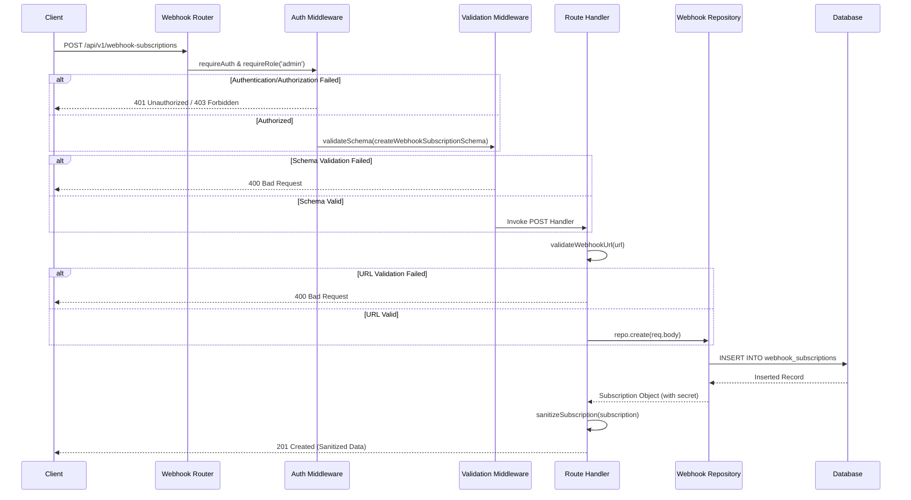

# Webhooks Request Lifecycle

This document provides an end-to-end view of the request lifecycle for webhook subscriptions in the Talenttrust-Backend. It covers the flow from the moment an HTTP request is received to its persistence in the database and the response sent back to the client.

## Request Flow Diagram

The following sequence diagram illustrates the step-by-step lifecycle of a `POST /api/v1/webhook-subscriptions` request:

## Lifecycle Stages

### 1. Routing
The entry point for webhook subscription requests is defined in `src/app.ts`, which mounts the router at `/api/v1/webhook-subscriptions`. The router itself is implemented in `src/routes/webhook-subscription.routes.ts`.

### 2. Authentication and Authorization (Auth)
Before a request can be processed, it must pass through security middleware:
- **`requireAuth`**: Ensures the request is made by an authenticated user.
- **`requireRole('admin')`**: Restricts the creation, updating, and deletion of webhook subscriptions to users with admin privileges.
These middleware functions are located in `src/middleware/authorization.ts`.

### 3. Validation
The request payload and parameters are validated to ensure they meet the expected schema:
- **`validateSchema`**: Uses Zod schemas (e.g., `createWebhookSubscriptionSchema` from `src/modules/webhooks/dto/webhook-subscription.dto.ts`) to validate the request body structure. Found in `src/middleware/validate.middleware.ts`.
- **`validateWebhookUrl`**: A specialized validation step within the route handler that verifies the provided webhook URL is valid and secure. Located in `src/routes/webhook-subscription.validation.ts`.

### 4. Handler
The core business logic resides in the route handlers in `src/routes/webhook-subscription.routes.ts`. The handler:
1. Calls the repository to persist the data.
2. Intercepts the created subscription object.
3. Sanitizes the response (via `sanitizeSubscription`) to ensure sensitive information, such as the webhook `secret`, is never exposed to the client.

### 5. Persistence (Store)
The handler interacts with the data layer through the `SqliteWebhookSubscriptionRepository` (`src/repositories/webhook-subscription.repository.ts`). The repository executes the SQL statements needed to persist the subscription to the SQLite database (`src/db/database.ts`).
